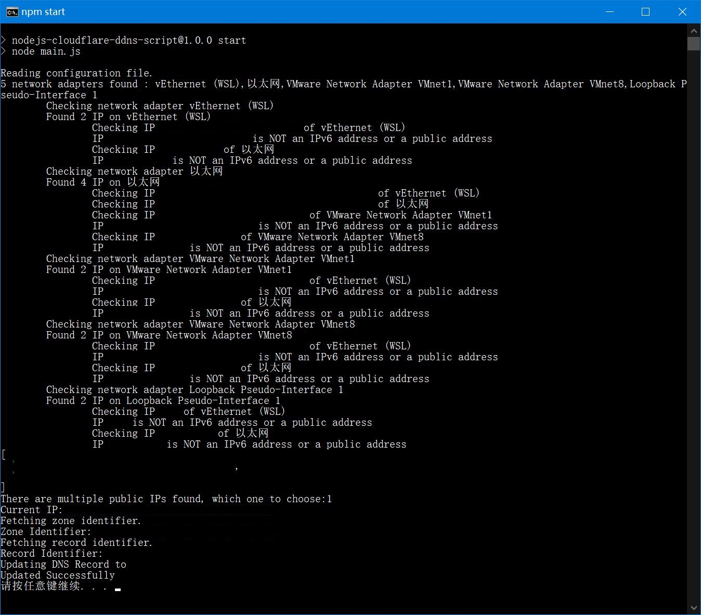

# Node-CF-DDNS
This is a script to change Cloudflare DNS records automatically with your current IP address<br><br>


# Screenshots
## Verbose mode:

## Normal output`(Havn't upload yet)`
## Quiet Output`(Havn't upload yet)`
# Installation
```cmd
npm install
```
## Configuration

Make a copy of `config.sample.json`, and edit it with following rules.

```json
{
	"cfKey": "Your Clouflare API Key, get it at https://dash.cloudflare.com/profile/api-tokens",
	"email": "Email you uesd to login to Cloudflare",
	"zoneName": "ZoneName",
	"recordType": "A or AAAA",
	"recordName": "Record Name",
	"TTL": 120
}
```
Then rename it to `config.json`.
## To run it directly
```cmd
npm start
```
## To use it in your project
```javascript
const ddns=require('node-cloudflare-dynamic-dns');
ddns.update(options);
ddns.updateSync(options); //through sync
```
The parameter `option` is *optional*.<br>
Parameter `options` is like the followings:
```javascript
option={
	"wanIPv4Site":"https://ipv4.icanhazip.com",	//Refers to the website which used to get your current IPv4 address. Default: https://ipv4.icanhazip.com
												//If you're using IPv6 mode , then this is optional.
	"mode": "verbose|normal|quiet",				//Output mode. Default: "normal"
				 								//if there's multiple IPv6 address, quiet mode will choose the first one automaticly.
	"autoSwitch": true|false,					//If IPv6 mode cannot use , use IPv4 automaticly or it will throw out an exception. Default: false.
	"config.json":{ 							//With this parameter the program will not read file 'config.json'
		"cfKEY": "EXAMPLEEXAMPLEEXAMPLEEXAMPLEEXAMPLEEX",
		"email": "someone@example.com",
		"zoneName": "example.com",
		"recordType": "A",
		"recordName": "ddns.example.com",
		"TTL": 120
	}
}
```
# If there is a better code solution, please send a `Pull Request` or `Issue` to me
Thanks.<br>
:D